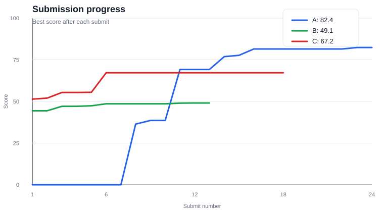

# ML Challenge 2026

Репозиторий с решениями трех задач ML-соревнования:

- **A: Adaptive Puzzle Solving** - универсальный solver для обратимых дискретных головоломок.
- **B: Novel View Synthesis** - восстановление нового вида по камерам, lidar и позам.
- **C: Effective Inference** - быстрый инференс маленькой LLM на школьных вопросах.

## Итоги

| Задача | Лучший скор | Решение |
|---|---:|---|
| A | **82.4** | ValueNet как эвристика для батчевого A* search |
| B | **49.1** | Geometry warp + residual U-Net refiner |
| C | **67.2** | vLLM, категорийные промпты, exact-match shortcut и token budgets |

## Прогресс посылок

График показывает лучший достигнутый скор после каждого сабмита внутри задачи.
Источник данных: [`docs/submissions.csv`](docs/submissions.csv).



## Структура

```text
AdaptivePuzzle/       # Task A
NovelView/            # Task B
EffectiveInference/   # Task C
docs/
├── statements/       # условия задач
├── submissions.csv   # история скоров
└── submissions_progress.svg
```

Крупные артефакты не хранятся в git: датасеты, веса, checkpoints, submissions,
логи и runtime-кэши.
